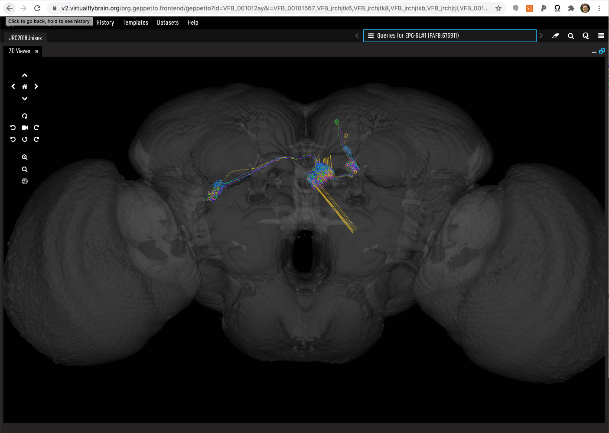

Basic installation procedure (not run)

```{r, eval=FALSE}
natmanager::install('natverse')
vfbconnectr::vc_install()
```


```{r, message=FALSE}
# load packages
library(vfbconnectr)
library(natverse)
library(dplyr)

# if Running on Rstudio server (==cloud) use plotly as visualisation default
#if(isTRUE(Sys.getenv('RSTUDIO_PROGRAM_MODE')=="server"))
options(nat.plotengine = 'plotly')
```

Set up connections to VFB APIs and VFB CATMAID server.

```{r}
# vfb_connect object
# vc = VfbConnect(neo_endpoint="http://pdb.p2.virtualflybrain.org")
vc = VfbConnect()
# Connect to the VFB CATMAID server hosting the FAFB data
catmaid::vfbcatmaid('fafb')
```

## Mapping

Use case: If I have a single neuron, how can I find other neurons of the same or similar type within or between data sources?

#### Mapping via common parent type

Let's take some examples from a discovery query on the previous spreadhseet

```{r}
sayin_tab = vc_df(vc$get_instances_by_dataset('Sayin2019', summary=T))
sayin_tab
```

```{r}
oct_VPM3 = vc_df(vc$get_instances('octopaminergic VPM3 neuron', summary=T))
oct_VPM3
```

```{r}
oct_VPM3_images = vc$neo_query_wrapper$get_images(oct_VPM3[,'id'], stomp=T, 
                                                  template='JRC2018Unisex', 
                                                  image_folder ='oct_VPM3b')
oct_VPM3_images
```

Download the images onto a location on disk.
```{r}
oct_VPM3_images = vc$get_images_by_type('octopaminergic VPM3 neuron', stomp=T, template='JRC2018Unisex', image_folder = 'oct_VPM3')
```

This is our first 3D plot. Notice how the neurons from different datasets 
overlap. This is because they have all been transformed to a common template 
brain.

```{r}
nl = read.neurons('oct_VPM3b/')
nl
```

Now let's plot

```{r}
plot3d(nl, plotengine = 'plotly')
```


#### Mapping via NBLAST

VFB supports image based queries that find neurons with similar morphology to a query neuron. We use a matrix of [NBLAST](https://www.ncbi.nlm.nih.gov/pmc/articles/PMC4961245/) scores for this purpose.  This currently covers mapping between FAFB & Hemibrain and internal mappings within the hemibrain and FlyCircuit neurons. More mappings will be added soon, as well as support for other similarity mappings.

```{r}
vc$neo_query_wrapper$get_anatomical_individual_TermInfo(list('VFB_001012ay'), summary=T) %>% 
    vc_df()
```


```{r}
similar_to_EPG6L1 = vc$get_similar_neurons('VFB_001012ay')
similar_to_EPG6L1 
```

```{r}
EPG6L1_similar_images = vc$neo_query_wrapper$get_images(
    c(similar_to_EPG6L1[, 'id'], 'VFB_001012ay'),
    template = 'JRC2018Unisex',
    # this little trick stores the location of the temp folder in a variable
    image_folder = EPG6L1folder <- tempfile('EPG6L1'),
    stomp = T
) # Note - stomp allows an existing folder to be over-written


EPG6L1_similar_images
```

```{r}
EPG6L1_similar_images['parents_label']
```

```{r}
nl = read.neurons(EPG6L1folder)
```

```{r}
nclear3d()
plot3d(nl, plotengine = 'plotly')
```


Ugly, let's get rid of those spiky bits. To clean up 'spiky' neurons with obvious alignment issues you can use the elmr function [unspike](http://natverse.org/elmr/reference/unspike.html)

```{r}
nclear3d()
# 5000 nm threshold for spike size
plot3d(elmr::unspike(nl,threshold = 5), plotengine = 'plotly', soma=T)
plot3d(JRC2018U)
```

Let's get a link to a scene in the VFB viewer including those different ids:

```{r}
vc$get_vfb_link(c(similar_to_EPG6L1[,'id'],'VFB_001012ay'), template='JRC2018Unisex') %>%
    browseURL()
```


